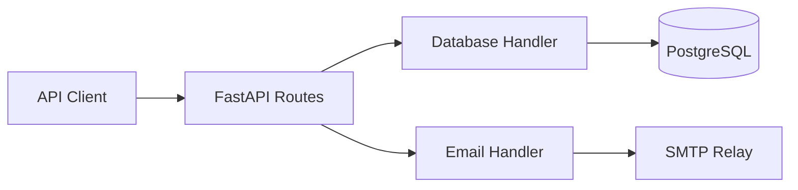
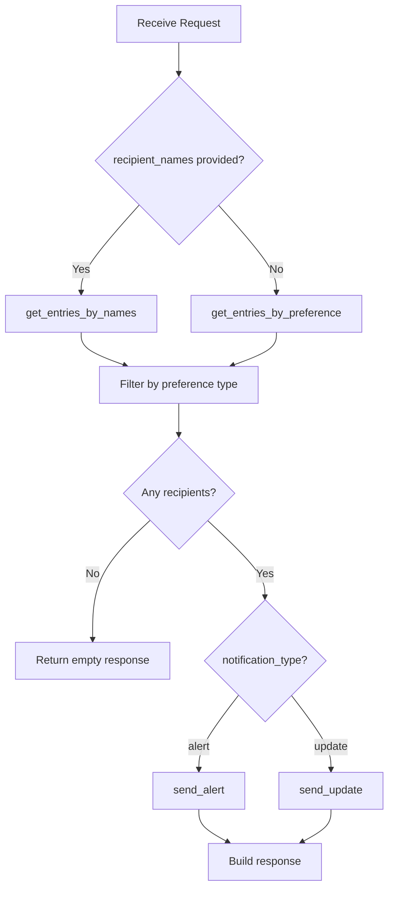

# Notification Service - Email Sending Feature Walkthrough

This document explains the email notification functionality added to the notification service.

---

## Architecture Overview



The notification service now has two main capabilities:
1. **User Preference Management** — CRUD operations for notification preferences (existing)
2. **Email Sending** — Send alerts/updates to users based on their preferences (new)

---

## New Files

### 1. Email Handler — [email_handler.py](file:///home/bj/projects/license-plate-system/services/notification-service/src/handlers/email_handler.py)

The core email sending logic using Python's `smtplib`.

**Key Components:**

| Component | Purpose |
|-----------|---------|
| `EmailHandler` class | Encapsulates SMTP connection and sending logic |
| `send_email()` | Send a single email (plain text or HTML) |
| `send_bulk_email()` | Send to multiple recipients, returns success/failure per recipient |
| `send_alert()` | Wrapper that prefixes subject with `[ALERT]` |
| `send_update()` | Wrapper that prefixes subject with `[UPDATE]` |
| `email_handler` | Pre-configured singleton instance using settings |

**Example Usage:**
```python
from src.handlers.email_handler import email_handler

# Send to all alert subscribers
results = email_handler.send_alert(
    recipients=["user1@example.com", "user2@example.com"],
    subject="System Alert",
    body="Something important happened"
)
# results = {"user1@example.com": True, "user2@example.com": False}
```

**Error Handling:**
- Raises `EmailSendError` on SMTP failures
- In `send_bulk_email()`, failures are caught per-recipient so one failure doesn't stop others

---

### 2. Notification Schemas — [notification.py](file:///home/bj/projects/license-plate-system/services/notification-service/src/schemas/notification.py)

Pydantic models for the notification API.

| Schema | Purpose |
|--------|---------|
| `NotificationRequest` | Input for sending notifications |
| `NotificationRecipientResult` | Per-recipient success/failure |
| `NotificationResponse` | Overall send results with counts |

**NotificationRequest Fields:**
```python
notification_type: Literal["alert", "update"]  # Which preference to filter by
subject: str                                    # Email subject (max 200 chars)
body: str                                       # Email body content
recipient_names: list[str] | None              # Optional: target specific users
html: bool = False                             # Send as HTML email
```

---

### 3. Notifications API — [notifications.py](file:///home/bj/projects/license-plate-system/services/notification-service/src/api/routes/notifications.py)

**Endpoint:** `POST /api/notifications/send`

**Flow:**


**Recipient Selection Logic:**
1. If `recipient_names` provided → fetch those users, then filter by preference flag
2. If not provided → fetch all users where the preference flag is `True`

---

## Modified Files

### 4. Config — [config.py](file:///home/bj/projects/license-plate-system/services/notification-service/src/config.py)

Added SMTP settings:

```python
smtp_relay_host: str = Field(..., alias='SMTP_RELAY_ADDRESS')
smtp_port: int = Field(25, alias='SMTP_PORT')
```

These are read from environment variables and used by `EmailHandler`.

---

### 5. Database Handler — [database_handler.py](file:///home/bj/projects/license-plate-system/services/notification-service/src/handlers/database_handler.py)

Added three new functions:

| Function | Purpose |
|----------|---------|
| `delete_entry(db, entry_id)` | Hard delete a user preference record |
| `get_entries_by_preference(db, receive_alerts, receive_updates)` | Filter users by their notification preferences |
| `get_entries_by_names(db, names)` | Fetch specific users by username list |

**get_entries_by_preference Example:**
```python
# Get all users who want to receive alerts
alert_users = get_entries_by_preference(db, receive_alerts=True)

# Get all users who want updates
update_users = get_entries_by_preference(db, receive_updates=True)
```

---

### 6. User Preferences API — [user_preferences.py](file:///home/bj/projects/license-plate-system/services/notification-service/src/api/routes/user_preferences.py)

**New Endpoint:** `DELETE /api/user_preferences/{entry_id}`

Returns `204 No Content` on success, `404 Not Found` if user doesn't exist.

---

### 7. Router — [router.py](file:///home/bj/projects/license-plate-system/services/notification-service/src/api/router.py)

Added the notifications router:
```python
api_router.include_router(notifications.router, prefix='/notifications', tags=['notifications'])
```

---

## Configuration

### Environment Variables

| Variable | Required | Default | Description |
|----------|----------|---------|-------------|
| `SENDER_ADDRESS` | Yes | — | Email "From" address |
| `SMTP_RELAY_ADDRESS` | Yes | — | SMTP server hostname/IP |
| `SMTP_PORT` | No | 25 | SMTP server port |

These are configured in [.env.example](file:///home/bj/projects/license-plate-system/.env.example) and passed via docker-compose.

---

## Testing

### Test Coverage: 95%

| Test File | Tests | Coverage |
|-----------|-------|----------|
| [notifications_api_test.py](file:///home/bj/projects/license-plate-system/services/notification-service/src/tests/notifications_api_test.py) | 6 | Send endpoints with mocked email handler |
| [email_handler_test.py](file:///home/bj/projects/license-plate-system/services/notification-service/src/tests/email_handler_test.py) | 6 | Email handler with mocked SMTP |
| [api_test.py](file:///home/bj/projects/license-plate-system/services/notification-service/src/tests/api_test.py) | 13 | User preferences CRUD + delete |
| [database_handler_test.py](file:///home/bj/projects/license-plate-system/services/notification-service/src/tests/database_handler_test.py) | 21 | All database operations |

**Run tests:**
```bash
docker compose -f docker-compose.dev.yaml run --rm notification-service pytest --cov=src -v
```

---

## API Reference

### POST /api/notifications/send

**Request:**
```json
{
  "notification_type": "alert",
  "subject": "Security Alert",
  "body": "Unauthorized access detected",
  "recipient_names": ["admin", "security_team"],
  "html": false
}
```

**Response:**
```json
{
  "total_recipients": 2,
  "successful": 2,
  "failed": 0,
  "results": [
    {"email": "admin@example.com", "success": true},
    {"email": "security@example.com", "success": true}
  ]
}
```

### DELETE /api/user_preferences/{entry_id}

**Response:** `204 No Content` on success
