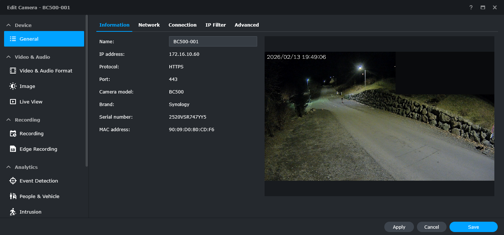
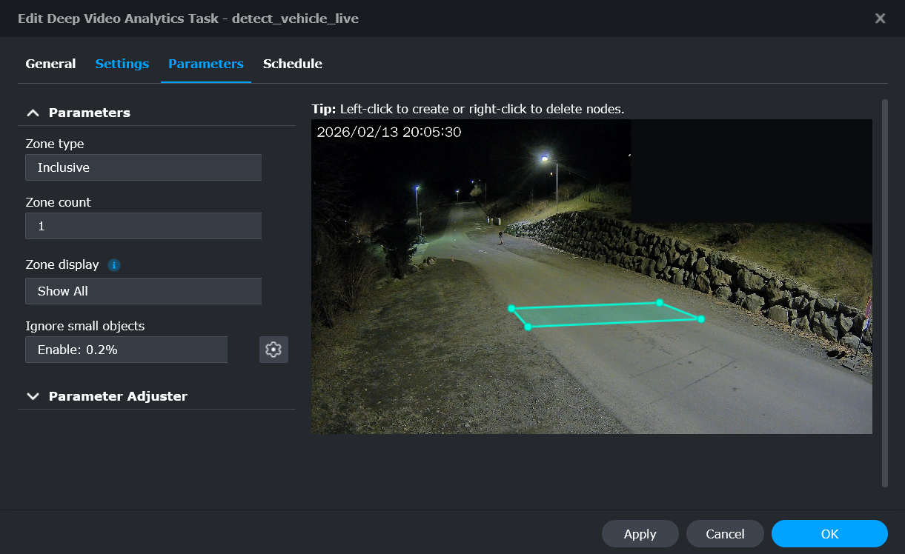
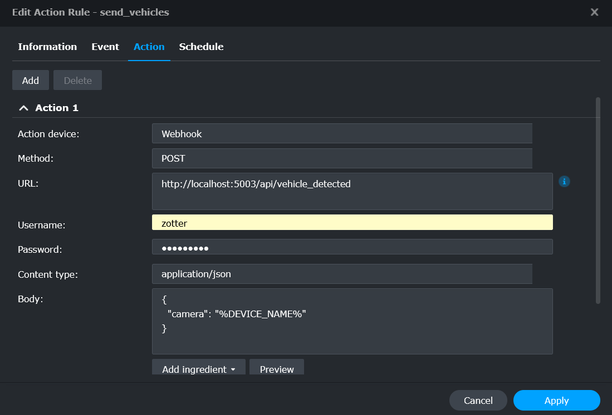
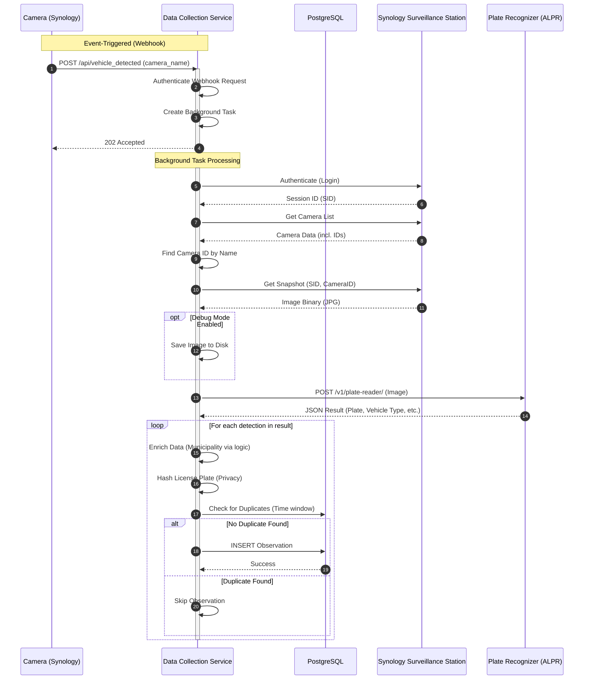
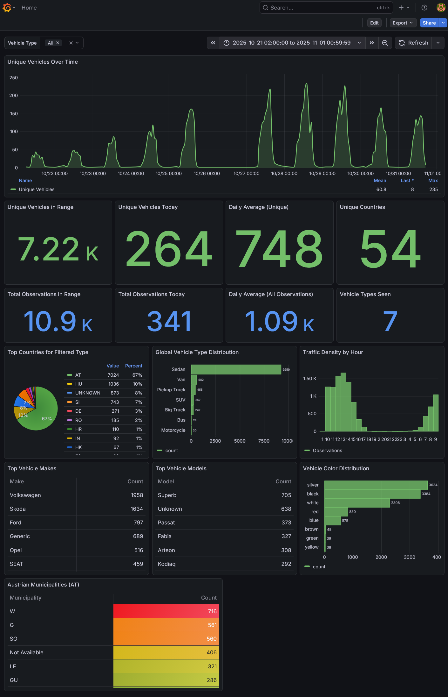

# Implementierung

Dieses Kapitel dokumentiert die technische Umsetzung der in der Architektur beschriebenen Komponenten.
Zunächst wird auf die Konfiguration der Synology Surveillance Station eingegangen, welche für einen korrekten Betrieb des Systems notwendig ist.
Für jeden Service werden die zentralen Abläufe, Designentscheidungen und relevante Code-Auszüge dargestellt, wobei der Fokus dieses Kapitels auf der Kernkompente, dem Data Collection Service liegt.


## Konfiguration Synology Surveillance Station

Auf der Surveillance-Station-Platform können alle Bereiche des Synology Überwachungssystems konfiguriert werden.
Für diese Diplomarbeit sind jene Bereiche relevant, welche sich mit der Konfiguration der IP-Kameras, der Fahrzeugerkennung und der Aktionen (Trigger) befassen.


### IP Camera Konfiguration

Mit dem IP Camera-Tool können Synology-Kameras im Netzwerk automatisch erkannt und konfiguriert werden.
Zunächst wurde die installierte Kamera mit Hilfe dieses Tools erkannt und zum System hinzugefügt, dies funktionierte schnell ohne jegliche Komplikationen.
In den Einstellungen der hinzugefügten IP-Kamera wurden Optionen wie die Bildrate oder Auflösung der Kamera maximiert, um die bestmöglichen Gründvoraussetzungen für eine erfolgreiche Erkennung zu bieten.

(FOOTNOTE: Der in der Abbildung (X) ersichtliche schwarze Balken in der rechten, oberen Ecke dient dem Datenschutz der auf anderen Straßenseite befindlichen Familienhäuser und schränkt die Funktion des Systems in keiner Weise ein.)




### Deep Video Analytics Konfiguration

Da wie bereits im Kapitel Hardwareauswahl (!! CROSS REFERENCE) erwähnt die Synology DVA-Serie als NAS-System gewählt wurde, standen für die Umsetzung dieses Projects die erweiterten KI-Funktionen dieser Reihe zur Verfügung, diese werden von Synology als Deep Video Analytics (DVA) bezeichnet
Eine dieser Funktionalitäten ist eine präzise und schnelle Durchfahrtskontrolle mittels Erkennungsbereichen. 
Diese wurde genutzt, um den unten in der Abbildung (X) erkenntlichen Bereich zu markieren, in welchen ein Trigger ausgelöst wird, sobald ein Fahrzeug diesen durchfährt.
Hierbei ist wichtig zu Erwähnen, dass dieser DVA-Task so konfiguriert wurde, dass Fußgänger und stehende Fahrzeuge nicht erkannt werden.
Diese Einschränkungen sind wichtig, um das ALPR-System zu entlasten und Mehrfacherkennungen durch im Bereich befindliche, stationäre Fahrzeuge zu eliminieren.



### Action Rule Konfiguration

Innerhalb der Surveillance Station können sogenannte Action-Rules definieren werden, welche bei Erkennung einer Fahrzeugbewegung im konfigurierten Erkennungsbereich eine zuvor definierte Aktion ausführen.
Dieses System wird genutzt, um im Falle einer Erkennung dem Data Collection Service zu Signalisieren, dass eine Fahrzeugerkennung stattgefunden hat. 
Diese Aktionsregel wird aufgerufen, nachdem der zuvor konfigurierte DVA-Task ein Fahrzeug erkennug und ist damit der Startpunkt, für die im Backend stattfindende Verarbeitung der Bilddaten.
Wie in Abbildung (X) erkenntlich ruft diese eine Webhook des Data Collection Service auf, diese wird im Kapitel (!! CROSS REFERNCE) näher beleuchtet.




## Data Collection Service

Der Data Collection Service bildet das funktionale Herzstück des gesamten Systems.
Er ist für die Entgegennahme von Fahrzeugerkennungsereignissen, die Beschaffung von Kamera-Snapshots, die Weiterleitung an die ALPR-Komponente zur Erkennung, sowie die Verarbeitung, Anonymisierung und persistente Speicherung der Ergebnisse verantwortlich.


### Konzept und Aufbau

Der Service ist als FastAPI-Applikation implementiert und folgt einer modularen Architektur, wobei jeder funktionale Bereich in eine eigene Klasse (Handler) ausgelagert ist, was eine klare Trennung der Verantwortlichkeiten (Separation of Concerns) ermöglicht:

- CameraHandler: Dieser Kapselt die gesamte Kommunikation mit der Synology Surveillance Station API (Authentifizierung, Kamera-Verwaltung, Snapshot-Abruf).
- PlateRecognizerHandler: Verwaltet die HTTP-Kommunikation mit dem Plate Recognizer SDK-Container.
- CountryHandler: Übernimmt die Anreicherung der Erkennungsdaten um regionale Herkunftsinformationen (Bezirkserkennung).
- DatabaseHandler: Verantwortlich für die Datenaufbereitung, Anonymisierung und die Speicherung der Erkennungen in der Datenbank.

Die Konfiguration des Services erfolgt über Umgebungsvariablen, welche mittels Pydantic Settings validiert werden.
Hierzu zählen unter anderem die Zugangsdaten für die Synology-API, der API-Key für Plate Recognizer, die Datenbankverbindungsparameter sowie ein konfigurierbares Duplikat-Erkennungsintervall.


### Externer Trigger

Eine HTTP-Webhook ist wie zuvor erwähnt der Auslöser für die Verarbeitung der Bilddaten, welche von der Synology Surveillance Station bei der Erkennung eines Fahrzeugs aufgerufen wird.

Der Webhook-Endpunkt `POST /api/vehicle_detected` erwartet im Request-Body den Namen der auslösenden Kamera und ist durch HTTP Basic Authentication geschützt, wie im Sicherheitskonzept (!! Cross Reference) erläutert.
Bei eingehenden Requests wird zunächst die Authentifizierung gegen die konfigurierten Synology-Credentials geprüft.
Nach erfolgreicher Validierung wird die Verarbeitung als Hintergrundaufgabe (Background Task) gestartet, während der Endpunkt sofort mit dem HTTP-Statuscode `202 Accepted` antwortet.

Dieses asynchrone Verarbeitungsmuster ist eine bewusste Designentscheidung:
Da die vollständige Verarbeitungskette, bestehend aus Snapshot-Abruf, ALPR-Analyse und Datenbankspeicherung, mehrere Sekunden in Anspruch nehmen kann, würde eine synchrone Verarbeitung die Surveillance Station blockieren und potenzielle Folge-Events verzögern.
Durch die Entkopplung mittels Background Tasks wird sichergestellt, dass der Webhook-Endpunkt jederzeit mit minimaler Latenz erreichbar bleibt, und auch bei hoher Fahrzeugfrequenz keine Events aufgrund von Timeouts von der Surveillance Station verworfen werden.

Der Detektionszeitpunkt wird dabei bereits im HTTP-Endpoint erfasst und nicht erst im Background Task.
Dies stellt sicher, dass der Zeitstempel den tatsächlichen Zeitpunkt des Webhook-Aufrufs widerspiegelt und nicht den Zeitpunkt der eventuell verzögerten Verarbeitung.

```python
@app.post('/api/vehicle_detected')
async def handle_vehicle_detection(
    request: VehicleDetectionRequest,
    background_tasks: BackgroundTasks,
    credentials: HTTPBasicCredentials = Depends(basic_auth),
):
    if credentials.username != settings.synology_username or credentials.password != settings.synology_password:
        raise HTTPException(status_code=401, detail='Incorrect username or password')

    logger.info(f'Vehicle detected from camera: {request.camera}')

    detection_time = datetime.now()
    timestamp_str = detection_time.strftime('%Y%m%d_%H%M%S')

    background_tasks.add_task(
        process_vehicle_detection,
        request.camera,
        detection_time,
    )

    return {'status': 'accepted', 'timestamp': timestamp_str}
```

### Ablauf der Verarbeitung

Die folgende Darstellung zeigt den vollständigen Ablauf von der Webhook-Auslösung bis zur Speicherung in der Datenbank als Sequenzdiagramm:



Wie dem Diagramm zu entnehmen ist, durchläuft jede Erkennung nach dem Webhook-Eingang die folgenden Phasen, welche in den nächsten Unterkapitel im Detail erläutert werden:
Kamera-Anbindung, ALPR-Aufruf, Datenanreicherung, Anonymisierung und Speicherung mit Duplikatprüfung.


### Kamera-Anbindung (CameraHandler)

Die Kommunikation mit der Synology Surveillance Station erfolgt über die dezidierte Web-API dieser und ist in der CameraHandler-Klasse gekapselt.
Der Ablauf der Kamera-Interaktion gliedert sich in drei Schritte:

1. Authentifizierung
Zunächst authentifiziert sich der Service über den API-Endpunkt `SYNO.API.Auth` und erhält eine Session-ID (SID), die für alle nachfolgenden API-Aufrufe als Identifikation dient.

2. Kameraliste und Identifikation
Im zweiten Schritt wird die Liste aller im Surveillance-Station-Netzwerk registrierten Kameras über den `SYNO.SurveillanceStation.Camera`-Endpunkt abgerufen.
Aus dieser Liste wird die Kamera anhand des vom Webhook übermittelten Namens identifiziert und die zugehörige Kamera-ID extrahiert.

3. Snapshot-Abruf
Mit der ermittelten Kamera-ID wird über die `GetSnapshot`-Methode der Synology-API ein aktueller Kamera-Snapshot, also das Kamerabild zum Zeitpunkt der Anfrage, im JPEG-Format angefordert.
Die Bilddaten werden als Byte-Stream im Arbeitsspeicher gehalten, ohne auf die Festplatte geschrieben zu werden, um personenbezogene Bilddaten nicht persistent zu speichern.
Optional kann im Debug-Modus, welcher über eine Umgebungsvariable aktiviert wird, das Bild zu Diagnosezwecken auf die Festplatte geschrieben werden.

Jeder der drei Schritte ist durch spezifische Exceptions (AuthenticationError, CameraDataError, SnapshotError) abgesichert, die im Fehlerfall die Verarbeitungskette kontrolliert abbrechen.


### Plate Recognizer Integration (PlateRecognizerHandler)

Die Bilddaten des Kamera-Snapshots werden an den lokal betriebenen Plate Recognizer SDK-Container zur Kennzeichenerkennung gesendet.
Der PlateRecognizerHandler-Klasse implementiert diesen HTTP-Aufruf mit einer Retry-Strategie mittels der tenacity-Bibliothek:

```python
class PlateRecognizerHandler:

    @retry(
        wait=wait_fixed(1),
        stop=stop_after_attempt(5),
        retry=retry_if_exception_type(requests.HTTPError),
        reraise=True,
    )
    def send_to_api(self, api_key: str, image_data: bytes, 
                    camera_name: str, service_url: str) -> Any:
        image_buffer = BytesIO(image_data)
        response = requests.post(
            f'{service_url}/v1/plate-reader/',
            data={
                'camera_id': camera_name,
                'regions': ['at', 'hu', 'si', 'de'],
                'mmc': 'true',
                'direction': 'true',
            },
            files={'upload': image_buffer},
            headers={'Authorization': f'Token {api_key}'},
            timeout=15,
        )
        response.raise_for_status()
        return response.json()
```

Der @retry-Dekorator sorgt dafür, dass bei HTTP-Fehlern (etwa temporäre Überlastung des ALPR-Containers) bis zu fünf Wiederholungsversuche im Abstand von einer Sekunde unternommen werden.
Dies erhöht die Robustheit des Systems erheblich, da kurzzeitige Ausfälle der ALPR-Komponente nicht zum Verlust von Erkennungen führen.

Der Parameter regions schränkt die Erkennung auf die relevanten Regionen ein, für diese Diplomarbeit wurden aufgrund der Lage der Zotter Schokolade GmbH, Österreich, Ungarn, Slowenien und Deutschland gewählt.
Dies verbessert die Erkennungsgenauigkeit, da das Modell die länderspezifischen Kennzeichenformate dieser Regionen priorisiert.
Über den Parameter `mmc` (Make, Model, Color) wird die erweiterte Fahrzeugerkennung aktiviert, durch `direction` wird die Fahrtrichtung anhand der Fahrzeugorientierung angefordert.
Die Bilddaten werden als `BytesIO`-Objekt übergeben, also als im Arbeitsspeicher gehaltener Byte-Stream.


### Datenverarbeitung und Enrichment-Schleife

Nach dem Empfang der JSON-Antwort von Plate Recognizer durchlaufen die Erkennungsdaten eine mehrstufige Verarbeitungs- und Anreicherungsschleife.
Die Plate-Recognizer-API kann in einem einzelnen Bild mehrere Kennzeichen erkennen, weshalb die Antwort eine Liste von Ergebnissen enthält, welche jeweils einzeln verarbeitet werden.

Datenextraktion
Im ersten Schritt werden die relevanten Felder aus der JSON-Antwort der Plate-Recognizer-API extrahiert und in ein Pytantic-Schema überführt.
Die API liefert den Konfidenzwert der Erkennung als Float-Zahl zwischen 0 und 1 zurück, welcher für die Speicherung mit 1000 multipliziert und als ganzzahliger Wert abgelegt wird.
Die Fahrzeugorientierung wird aus der API-Antwort als Enum (`FRONT` oder `REAR`) abgebildet, wobei `FRONT` einer Einfahrt und `REAR` einer Ausfahrt entspricht.

Bezirkserkennung (CountryHandler)
Die Bezirkserkennung ist ein zentraler Bestandteil der Datenanreicherung und ermöglicht es, das Herkunftsbundesland bzw. den Herkunftsbezirk eines Fahrzeugs aus dem Kennzeichen abzuleiten.
Die Implementierung nutzt hierfür eine JSON-Datei (`municipalities.json`), welche Bezirkskürzel für österreichische und slowenische Kennzeichen ihren vollen Namen und Bundesländern zuordnet.
Diese Zuordnungstabellen werden beim Start des Services einmalig in den Arbeitsspeicher geladen und als Dictionary-Lookup verwendet.

Der Erkennungsalgorithmus für österreichische Kennzeichen versucht zunächst, die ersten zwei Zeichen des Kennzeichens als Bezirkskürzel zu interpretieren.
Da einige österreichische Bezirke einbuchstabige Kürzel verwenden (wie z.B. "W" für Wien oder "G" für Graz), wird bei fehlgeschlagenem Zwei-Buchstaben-Lookup ein Fallback auf einbuchstabige Kürzel durchgeführt.

Für slowenische Kennzeichen wird ein ähnlicher Ansatz verfolgt, mit dem zusätzlichen Aspekt, dass der `CountryHandler` hier auch als Korrekturmechanismus dient:
Wird ein Kennzeichen von Plate Recognizer mit dem Ländercode `unknown` klassifiziert, der Kennzeichen-Präfix aber als slowenischer Bezirkscode erkannt, wird der Ländercode automatisch auf `si` korrigiert.
Diese Korrektur adressiert eine Limitierung der ALPR-Engine bei slowenischen Kennzeichen, welche aufgrund visueller Ähnlichkeiten zu anderen Formaten oft unerkannt bleiben.

Anonymisierung (Hashing)
Nach der Datenanreicherung folgt die Anonymisierung des Klartext-Kennzeichens.
Wie im Sicherheitskonzept (!! Cross Reference) beschrieben, wird das Kennzeichen mittels SHA-256 irreversibel gehasht.
Das Kennzeichen wird vor dem Hashing normalisiert (Trimmen von Leerzeichen, Konvertierung in Kleinbuchstaben), um sicherzustellen, dass identische Kennzeichen unabhängig von Schreibweisenunterschieden in der OCR-Erkennung denselben Hash erzeugen.
Der resultierende 32-Byte-Hash wird in Binärdaten in der Datenbank gespeichert.


### Duplikatprüfung und Speicherung

Da die Surveillance Station bei kontinuierlicher Fahrzeugbewegung im Erkennungsbereich mehrere Events in kurzem Abstand auslösen kann, implementiert der Service einen zeitbasierten Duplikatfilter.
Vor dem Einfügen einer neuen Erkennung prüft die Methode `check_for_duplicates`, ob in der Datenbank bereits eine Erkennung mit dem gleichen Kennzeichen-Hash innerhalb eines konfigurierbaren Zeitintervalls existiert.

```python
def check_for_duplicates(self, db: Session, observation: VehicleObservationCreate,
                         current_detection_time: datetime, interval: timedelta) -> bool:
    start_time = current_detection_time - interval
    stmt = select(VehicleObservation).where(
        and_(
            VehicleObservation.plate_hash == observation.plate_hash,
            VehicleObservation.timestamp >= start_time,
            VehicleObservation.timestamp <= current_detection_time,
        )
    )
    duplicate_observation = db.execute(stmt).scalars().first()
    return duplicate_observation is not None
```

Das Intervall ist über die Umgebungsvariable `INTERVAL_SECONDS` (Standardwert: 60 Sekunden) konfigurierbar.
Im Praxisbetrieb hat sich dieser Wert als geeignet erwiesen, um einerseits Mehrfacherkennungen desselben Fahrzeugs bei langsamer Durchfahrt zu eliminieren und andererseits aber Fahrzeuge, welche innerhalb kurzer Zeit tatsächlich ein- und ausfahren, korrekt als separate Ereignisse zu erfassen.
Nur wenn kein Duplikat gefunden wird, wird der anonymisierte und angereicherte Datensatz in die Datenbank eingefügt.

Die volle Methode für die Hintergrundverarbeitung von Erkennungen ist im Anhang einsehbar.

---

```python
@app.exception_handler(HTTPException)
async def http_exception_handler(request: Request, exc: HTTPException):
    """Custom exception handler to log all HTTPExceptions before returning the response"""
    logger.error(f'HTTP Exception: {exc.status_code} - {exc.detail} for url: {request.url}')

    return JSONResponse(
        status_code=exc.status_code,
        content={'detail': exc.detail},
    )


@app.post('/api/vehicle_detected')
async def handle_vehicle_detection(
    request: VehicleDetectionRequest,
    background_tasks: BackgroundTasks,
    credentials: HTTPBasicCredentials = Depends(basic_auth),
):
    if credentials.username != settings.synology_username or credentials.password != settings.synology_password:
        raise HTTPException(status_code=401, detail='Incorrect username or password')

    logger.info(f'Vehicle detected from camera: {request.camera}')

    detection_time = datetime.now()
    timestamp_str = detection_time.strftime('%Y%m%d_%H%M%S')

    background_tasks.add_task(
        process_vehicle_detection,
        request.camera,
        detection_time,
    )

    return {'status': 'accepted', 'timestamp': timestamp_str}


def process_vehicle_detection(camera_name: str, detection_time: datetime):
    """background task for vehicle detection handling

    Args:
        camera_name (str): name of the camera that called the webhook
        detection_time (datetime): time the event was triggered
    """
    try:
        with get_db() as db:
            # Authenticate client
            sid = camera_service.authenticate_client(
                host=settings.synology_host,
                username=settings.synology_username,
                password=settings.synology_password,
            )

            # Get camera data
            cameras = camera_service.get_camera_data(host=settings.synology_host, sid=sid)

            # Find target camera
            target_camera = camera_service.get_camera_by_name(cameras=cameras, camera_name=camera_name)

            # Get camera snapshot
            frame = camera_service.get_camera_snapshot(host=settings.synology_host, sid=sid, camera=target_camera)

            image_data = frame.content
            filename = f'observation_{detection_time}.jpg'
            filepath = os.path.join('/app/snapshots', filename)

            # Save image is enabled
            if settings.save_images_for_debug:
                try:
                    with open(filepath, 'wb') as f:
                        f.write(image_data)
                    logger.info(f'Snapshot saved to {filepath}')
                except Exception as e:
                    logger.exception(f'Failed to save image: {e}')

            # Send image to api
            result = plate_service.send_to_api(
                api_key=settings.api_key,
                image_data=image_data,
                camera_name=camera_name,
                service_url=settings.plate_recognizer_service_url,
            )
            if not result:
                logger.info('Plate Recognizer returned no actual observations')
                return
            logger.debug(f'Plate Recognizer results: {result}')

            # Add result to db
            observations_to_create = db_handler.new_observation(
                reader_result=result, detection_timestamp=detection_time
            )

            for observation_data in observations_to_create:
                observation_data = country_handler.get_municipality_and_fix_country(observation=observation_data)
                observation_data = db_handler.hash_plate(observation=observation_data)

                if not db_handler.check_for_duplicates(
                    db=db,
                    observation=observation_data,
                    current_detection_time=detection_time,
                    interval=timedelta(seconds=settings.interval_seconds),
                ):
                    db_handler.create_observation_entry(db=db, observation=observation_data)

    except (CameraException, PlateRecognizerException, DatabaseException) as e:
        logger.exception(f'{type(e).__name__}: {e}')
    except Exception as e:
        logger.exception(f'Unexpected error during background processing: {e}')
    return
```
---


## Notification Service

Der Notification Service ist ein eigenständiger FastAPI-Microservice, der die Verwaltung von Benutzerpräferenzen und den Versand von E-Mail-Benachrichtigungen übernimmt.

### Architektur und API-Design

Der Service stellt zwei primäre API-Routen bereit, welche unter dem /api-Präfix gruppiert sind.
Alle Endpunkte sind durch API-Key-Authentication im `Authorization`-Header geschützt, wie im Sicherheitskonzept erläutert wurde.

Benutzerpräferenzen (`/api/user_preferences`)
Diese Route stellt eine vollständige CRUD-Schnittstelle (Create, Read, Update, Delete) für die Verwaltung von Benutzerpräferenzen bereit.
Benutzer können über REST-Endpunkte erstellt, abgefragt, aktualisiert und gelöscht werden.
Jeder Benutzer verfügt über zwei unabhängige Flags: `receive_alerts` für Echtzeit-Benachrichtigungen und `receive_updates` für periodische Zusammenfassungen.

Benachrichtigungsversand (`/api/notifications`)
Der Benachrichtigungsendpunkt `POST /api/notifications/send` nimmt einen Request mit dem Benachrichtigungstyp (`alert` oder `update`), Betreff, Inhalt und optionaler Empfängerliste mit Email-Adressen entgegen.
Die interne Logik bestimmt die Empfänger auf folgende Weise:

1. Wenn der Request eine explizite Empfängerliste enthält, werden ausschließlich diese Adressen verwendet.
2. Andernfalls werden alle Benutzer aus der Datenbank anhand des jeweiligen Präferenz-Flags (`receive_alerts` bzw. `receive_updates`) gefiltert.


### E-Mail-Versand (EmailHandler)

Der eigentliche E-Mail-Versand erfolgt über den `EmailHandler`, welcher E-Mails über einen SMTP-Relay-Server versendet.
Der SMTP-Server des Unternehmens wird als Relay für den internen Versand SMTP (Simple Mail Transfer Protocol) genutzt um zu Verhindern, dass die versendeten Mails aufgrund von Spam-Verdacht nicht korrekt zugestellt werden.

Die Implementierung unterstützt sowohl Plaintext- als auch HTML-formatierte E-Mails.
Der Versand an mehrere Empfänger erfolgt über die `send_bulk_email`-Methode, welche für jeden Empfänger eine eigene SMTP-Verbindung aufbaut.
Fehlgeschlagene Zustellungen an einzelne Empfänger führen nicht zum Abbruch des gesamten Versandvorgangs, somit wird sichergestellt, dass ein ungültiger Empfänger nicht den Versand an alle anderen blockiert.


## Grafana

Als Visualisierungsplattform für die gesammelten Fahrzeugerkennungen dient Grafana, ein Open-Source-Tool für Datenvisualisierung und Monitoring.
Grafana wird als eigener Container im Docker-Compose-Stack betrieben und verbindet sich lesend mit der PostgreSQL-Datenbank.


### Architektur und Provisioning

Die Grafana-Konfiguration folgt dem Provisioning-Ansatz, bei dem Datenquellen und Dashboards nicht manuell über die Benutzeroberfläche, sondern deklarativ über Konfigurationsdateien definiert werden.
Dies hat den Vorteil, dass die gesamte Dashboard-Konfiguration im Repository liegt und beim Neustart des Containers automatisch wiederhergestellt wird.

Die Konfiguration gliedert sich in drei Bereiche:
1. grafana.ini: 
Grundkonfiguration des Grafana-Servers, unter anderem HTTP-Port, Sicherheitseinstellungen und der Pfad zum Standard-Dashboard, das beim Login automatisch geladen wird.

2. Datasource-Provisioning (`datasource.yaml`): 
Definiert die Verbindung zur PostgreSQL-Datenbank. 
Grafana verbindet sich über den `analytics_user`, der wie im Sicherheitskonzept beschrieben nur Leserechte auf das Ingestion-Schema besitzt. 
Die Verbindungsparameter (Host, Datenbankname, Credentials) werden über Umgebungsvariablen gesetzt.

3. Dashboard-Provisioning (`dashboard-provider.yaml` und Dashboard-JSON): 
Das Dashboard wird als JSON-Datei bereitgestellt und beim Start automatisch von Grafana geladen. 
Änderungen am Dashboard werden direkt in der JSON-Datei vorgenommen.


### Dashboard-Aufbau und Darstellungen

Das Dashboard bietet einen umfassenden Überblick über die gesammelten Fahrzeugdaten.
Alle Panels verwenden direkte SQL-Abfragen auf das Ingestion-Schema und unterstützen die dynamische Filterung nach Fahrzeugtyp sowie einen frei wählbaren Zeitraum.

Das Dashboard umfasst folgende Darstellungen:
- Zeitreihendiagramm: Verlauf der einzigartigen Fahrzeuge über die Zeit, mit dynamischer Aggregation je nach gewähltem Zeitraum.
- Kennzahlen-Panels: Acht Statistik-Boxen mit den wichtigsten Metriken, darunter einzigartige Fahrzeuge (Gesamt, Heute, Tagesdurchschnitt), Gesamterkennungen, Anzahl verschiedener Herkunftsländer und Fahrzeugtypen.
- Länderverteilung: Kreisdiagramm der Top-10-Herkunftsländer mit prozentualen Anteilen.
- Fahrzeugtypverteilung: Horizontales Balkendiagramm der erkannten Fahrzeugkategorien.
- Verkehrsdichte nach Tageszeit: Balkendiagramm mit stündlicher Aggregation zur Identifikation von Stoßzeiten.
- Fahrzeugdetails: Tabellen der häufigsten Fahrzeugmarken und -modelle sowie ein Balkendiagramm der Fahrzeugfarben, basierend auf der MMC-Erkennung von Plate Recognizer.
- Regionale Herkunft: Tabelle der österreichischen Bezirkskürzel mit zur schnellen visuellen Einordnung der häufigsten Herkunftsregionen.


