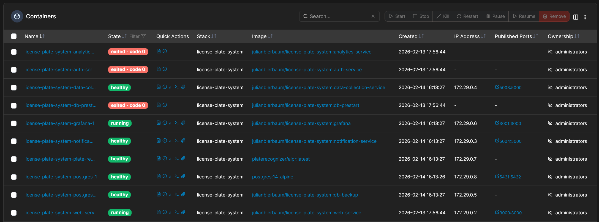
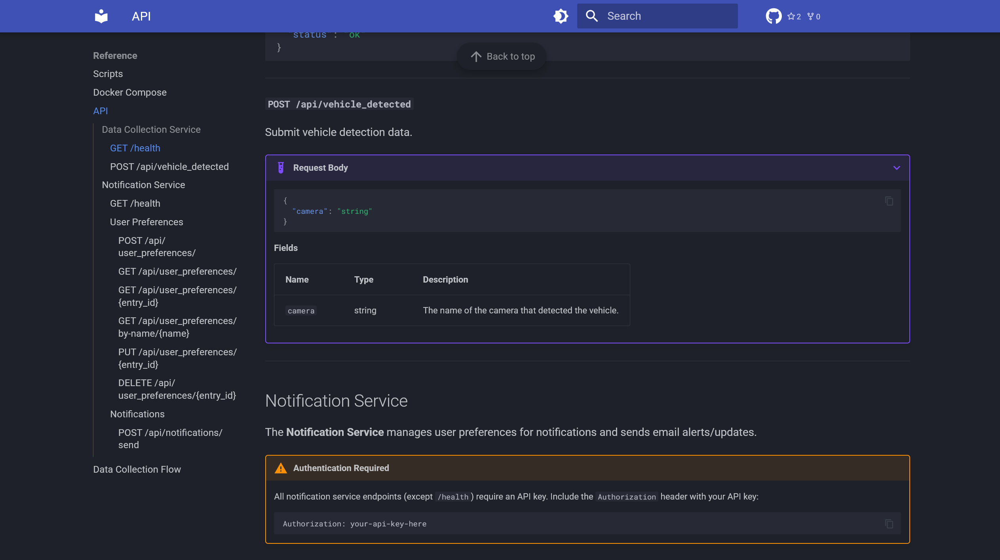

# Infrastruktur, Deployment und Betrieb

Dieses Kapitel behandelt die infrastrukturellen Komponenten und Prozesse dieser Diplomarbeit.
Erläutert werden unter anderem der Deployment-Prozess sowie die im laufenden Betrieb relevanten Aspekte wie Monitoring und Logging, Datenbank-Management und Backup-Strategien.


## Container-Orchestrierung

Die gesamte Applikation wird, mittels Docker Compose orchestriert, wobei zwei separate Konfigurationsdateien für die Entwicklungs- und Produktionsumgebungen benutzt werden.
Docker Compose nutzt, wie bereits im entsprechenden Kapitel erwähnt, YAML-Dateien, welche zur Kennung mit den Endungen `.prod.yaml` und `.dev.yaml` versehen wurden.
Beide Konfigurationen definieren dieselben Services, unterscheiden sich jedoch grundlegend in der Art und Weise, wie diese für Docker zum Starten bereitgestellt werden.


### Entwicklungsumgebung

In der Entwicklungsumgebung werden alle Services lokal aus ihren jeweiligen Dockerfiles gebaut.
Ein zentrales Merkmal ist die Verwendung von Volume-Mounts, welche lokale Dateiverzeichnisse direkt in die Container einbinden:

```yaml
data-collection-service:
  build:
    context: ./services/data-collection-service
    dockerfile: Dockerfile
  volumes:
    - ./services/data-collection-service/src:/app/src:rw
```

Durch diese Konfiguration werden Codeänderungen sofort im laufenden Container wirksam (Hot-Reload), ohne dass der Container neu gebaut werden muss.
Dies beschleunigt den Entwicklungszyklus erheblich, da Änderungen am Quellcode schnell in der Docker-Umgebung getestet werden können.


### Produktionsumgebung

Die Produktionskonfiguration verwendet hingegen vorgefertigte Docker-Images, welche über eine Docker-Registry heruntergeladen werden:

```yaml
data-collection-service:
  image: julianbierbaum/license-plate-system:data-collection-service
  restart: unless-stopped
```

Die Volume-Mounts für den Quellcode entfallen hier vollständig, da dieser direkt in die zuvor gebauten Images eingebettet wurde.
Eine wichtige Ausnahme hierbei ist allerdings das Volume der Datenbank, welches für den Bestand der Daten natürlich weiterhin außerhalb des Images gespeichert wird.
Dies bedeutet, dass diese Images vollständig eigenständig sind und alle Abhängigkeiten sowie den Applikationscode bereits enthalten.

Für das Deployment auf der Produktionsumgebung werden daher ausschließlich die Docker Compose-Datei und die Umgebungsvariablen zur Konfiguration benötigt, ein Klonen des Quellcode-Repositories ist nicht erforderlich.
Dies ist für die Nutzung von Portainer wichtig, ein Tool, welches später in diesem Kapitel näher beleuchtet wird.
Zusätzlich wurde die Restart-Policy strikter gesetzt, um sicherzustellen, dass Container nach einem Absturz oder einem Neustart des Host-Systems automatisch wieder hochgefahren werden.


### Startabhängigkeiten und Healthchecks

Ein wesentlicher Aspekt der Orchestrierung ist die korrekte Startreihenfolge der Services.
Da alle Applikationsservices eine funktionierende Datenbank voraussetzen, wird ein spezieller Datenbank-Prestart-Container eingesetzt, welcher die Datenbank initial konfiguriert.
Erst wenn dieser Container erfolgreich durchgelaufen ist, werden die abhängigen Services gestartet:

```yaml
depends_on:
  db-prestart:
    condition: service_completed_successfully
```

Der Prestart-Service wartet selbst wiederum auf den PostgreSQL-Container, welcher über einen so genannten Healthcheck seine Bereitschaft signalisiert.
Zusätzlich verfügen die Backend-Services und der Plate Recognizer-Container über eigene Healthchecks, mit welchen, über definierte HTTP-Endpunkte der aktuellen Zustand eines Services überwacht werden kann.


## CI/CD Pipelines und Deployment

CI/CD (Continuous Integration / Continuous Delivery) bezeichnet die Praxis, Codeänderungen automatisiert zu testen, bauen und bereitzustellen (https://www.redhat.com/en/topics/devops/what-is-ci-cd).
Continuous Integration stellt sicher, dass Codeänderungen automatisch auf Fehler geprüft werden, bevor diese in den Hauptbranch des Code-Repositories aufgenommen werden.
Continuous Delivery automatisiert darauf aufbauend den Build- und Bereitstellungsprozess, sodass neue Versionen automatisch auf dem Docker-Registry als Images zur Verfügung gestellt werden.

Die Umsetzung dieser Prinzipien erfolgt im Projekt über GitHub Actions, ein in GitHub integriertes Automatisierungstool, mit welchem Workflows zum Bauen, Testen und Bereitstellen von Software direkt im Repository definiert werden können (https://docs.github.com/en/actions). 
Diese Prozesse werden durch Ereignisse wie Code-Pushes oder Merges automatisch ausgelöst und führen die konfigurierten Schritte auf virtuellen Servern aus.

### Build und Test Pipeline

Die primäre CI/CD-Pipeline wird bei jedem Push auf einen beliebigen Branch ausgelöst und besteht aus zwei sequenziellen Phasen:

Phase 1: Testing und Linting
In der ersten Phase werden für jeden Python-Service automatisiert drei Prüfungen durchgeführt:

1. Formatierung (Ruff Format (https://docs.astral.sh/ruff/formatter/)): Überprüfung des Codes auf Einhaltung der definierten Formatierungsregeln.
2. Linting (Ruff Check (https://docs.astral.sh/ruff/linter/)): Statische Codeanalyse zur Erkennung von potenziellen Fehlern und Stilabweichungen.
3. Tests (Pytest mit Coverage): Ausführung aller Test-Cases, welche mit einer Codeabdeckungsanalyse kombiniert werden.

Alle Tests werden innerhalb von Docker-Containern ausgeführt, um eine konsistente und reproduzierbare Testumgebung zu gewährleisten, welche der Produktionsumgebung möglichst nahekommt.

Phase 2: Build und Push
Wenn die Testphase erfolgreich abgeschlossen wurde und der Push auf dem Haupt-Branch erfolgt, wird die zweite Phase ausgelöst.
Diese nutzt ein Build-Script, welches automatisiert alle Docker-Images baut und auf das definierte Registry pusht.

```bash
# Build all services
for SERVICE_DIR in services/*/; do
  SERVICE_NAME=$(basename "$SERVICE_DIR")
  echo "--- Building ${SERVICE_NAME} ---"

  # Check Python lock file
  if [ -f "${SERVICE_DIR}pyproject.toml" ] && [ ! -f "${SERVICE_DIR}uv.lock" ]; then
    echo "Error: ${SERVICE_DIR}uv.lock not found. Run uv sync first."
    exit 1
  fi

  # Check Node.js lock file
  if [ -f "${SERVICE_DIR}package.json" ] && [ ! -f "${SERVICE_DIR}package-lock.json" ]; then
    echo "Error: ${SERVICE_DIR}package-lock.json not found. Run npm install first."
    exit 1
  fi

  docker build -t "${DOCKER_REGISTRY}:${SERVICE_NAME}" "$SERVICE_DIR"
  docker push "${DOCKER_REGISTRY}:${SERVICE_NAME}"
done
```

Dieses iteriert, wie im Code-Ausschnitt zu sehen ist, über alle Service-Verzeichnisse und identifiziert dabei Services anhand ihrer Lock-Files.
Da für die Python-Services UV als Package Manager benutzt wurde, dient das uv.lock-File als Identifikationsmerkmal für diese.
Frontend-Services werden mittels des package-lock.json-Files identifiziert und alle anderen Services, welche nicht im Service-Verzeichnis liegen, werden separat aufgerufen.
Das vollständige build.sh-Script ist im Anhang einsehbar.

---
```bash
#!/bin/bash

# Build and push all project services
# Usage: ./build.sh

set -e

# Load .env only if not already set
if [ -f ".env" ]; then
    echo "Loading .env file..."
    set -a
    source ".env"
    set +a
else
    echo "Warning: .env file not found, assuming environment variables are provided by CI."
fi

if [ -z "${DOCKER_REGISTRY}" ]; then
    echo "Error: DOCKER_REGISTRY not set"
    exit 1
fi

DOCKER_REGISTRY="${DOCKER_REGISTRY}"

# Check for required lock files before building
if [ -f "db/pyproject.toml" ] && [ ! -f "db/uv.lock" ]; then
  echo "Error: db/uv.lock not found. Run 'cd db && uv lock' first."
  exit 1
fi

# Build db-prestart
echo "--- Building db-prestart ---"
docker build -t "${DOCKER_REGISTRY}:db-prestart" -f ./db/Dockerfile .
docker push "${DOCKER_REGISTRY}:db-prestart"

# Build db-backup
echo "--- Building db-backup ---"
docker build -t "${DOCKER_REGISTRY}:db-backup" -f ./db-backup/Dockerfile ./db-backup
docker push "${DOCKER_REGISTRY}:db-backup"

# Build shared-data
echo "--- Building shared-data ---"
docker build -f shared-data/Dockerfile -t "${DOCKER_REGISTRY}:shared-data" ./shared-data
docker push "${DOCKER_REGISTRY}:shared-data"

# Build grafana
echo "--- Building grafana ---"
docker build -t "${DOCKER_REGISTRY}:grafana" ./grafana
docker push "${DOCKER_REGISTRY}:grafana"

# Build all services
for SERVICE_DIR in services/*/; do
  SERVICE_NAME=$(basename "$SERVICE_DIR")
  echo "--- Building ${SERVICE_NAME} ---"

  # Check Python lock file
  if [ -f "${SERVICE_DIR}pyproject.toml" ] && [ ! -f "${SERVICE_DIR}uv.lock" ]; then
    echo "Error: ${SERVICE_DIR}uv.lock not found. Run uv sync first."
    exit 1
  fi

  # Check Node.js lock file
  if [ -f "${SERVICE_DIR}package.json" ] && [ ! -f "${SERVICE_DIR}package-lock.json" ]; then
    echo "Error: ${SERVICE_DIR}package-lock.json not found. Run npm install first."
    exit 1
  fi

  docker build -t "${DOCKER_REGISTRY}:${SERVICE_NAME}" "$SERVICE_DIR"
  docker push "${DOCKER_REGISTRY}:${SERVICE_NAME}"
done

echo "Build and push completed successfully!"
```

---

### Deployment mit Portainer

Deployment auf der Produktionsumgebung erfolgt über die Plattform Portainer, ein Container Management-Tool mit Weboberfläche (https://docs.portainer.io/).
Portainer wurde auf dem Synology-NAS installiert und ermöglicht das Verwalten der Docker-Container direkt über einen Browser.

Für das Deployment wird in Portainer ein Stack erstellt, welcher die Produktions-Compose-Datei sowie die Datei mit den Umgebungsvariablen enthält.
Bei Aktualisierungen werden die neuesten Images aus dem Docker-Registry heruntergeladen, woraufhin die betroffenen Container automatisch neu erstellt werden, ohne dass die Datenhaltung betroffen ist.




## Monitoring und Logging


### Healthchecks

Wie bereits erwähnt verfügen die Services über Healthchecks, welche von Docker Compose in regelmäßigen Intervallen (alle 5 Sekunden) ausgeführt werden und primär dazu dienen, die Verfügbarkeit der Services zu überwachen.
Die Methode des Healthchecks variiert je nach Service-Art:

- Backend-Services (Data Collection, Notification): HTTP-Request an den `/health`-Endpunkt des jeweiligen Services.
- PostgreSQL-Datenbank: Verwendung des nativen `pg_isready`-Kommandos zur Überprüfung der Datenbankbereitschaft.
- Plate Recognizer: HTTP-Request an den Root-Endpunkt des ALPR-Containers.
- Backup-Service: Überprüfung, ob der Cron-Daemon (`crond`) als Prozess läuft.

Der Status der Healthchecks ist über Portainer einsehbar und ermöglicht somit eine zentrale Überwachung des Status aller Container.


### Logging

Alle Services wurden so konfiguriert, dass Log-Ausgaben direkt auf die Konsole geschrieben werden (Console-Logging).
Das Log-Level ist über eine Umgebungsvariable konfigurierbar und wird in der Produktionsumgebung typischerweise auf INFO gesetzt, während in der Entwicklungsumgebung DEBUG als Standard dient.

Die Logs sind über Docker und Portainer einsehbar.
Durch die Verwendung des Python Logging-Moduls in allen Backend-Services wird ein einheitliches Log-Format erzeugt, welches Zeitstempel, Log-Level und den Namen des Services enthält, auf welchem der Log erstellt wurde.

```
2026-02-17 15:55:24,782 - data-collection-service - INFO - Vehicle detected from camera: BC500-001
2026-02-17 15:55:26,461 - data-collection-service - INFO - No vehicle observations found in reader result.
```

Des Weiteren könnte dieses Modul zukünftig ohne großen Mehraufwand erweitert werden, um etwa gleichzeitig mit dem Console-Log in zentrale Log-Files zu schreiben.


## Datenbank-Management


### Initiale Einrichtung

Die initiale Einrichtung der Datenbank erfolgt automatisch beim ersten Start des Systems über den DB-Prestart-Container.
Dieser führt ein Entrypoint-Script aus, das zwei Aufgaben erfüllt:
Zunächst führt dieser ein Init-Script aus. Dieses SQL-Script erstellt die spezifischen Datenbank-Schemas und -Benutzer der Services, welche bereits im Kapitel (!! Cross Reference) erläutert wurden.
Zudem werden die granularen Berechtigungen vergeben, wie sie im Sicherheitskonzept (!! Cross Reference) definiert wurden, beispielsweise erhält der Analytics-Service-User nur Leserechte auf das Ingestion-Schema.

Die zweite Aufgabe dieses Services ist die Ausführung der Datenbankmigrationen unter Benutzung von Alembic. 
Nach der zuvor erwähnten Schema-Erstellung werden automatisch alle ausstehenden Migrationen angewendet, um die Tabellen in den aktuellen Zustand zu bringen.
Durch diese automatisierte Einrichtung entfällt jegliche manuelle Datenbankadministration beim initialen Deployment oder beim Neuaufsetzen des Systems.

Das init.sql-Script ist im Anhang angeführt.

---
```sql
-- Create users with environment variable passwords
CREATE USER notification_user WITH PASSWORD :NOTIFICATION_DB_PASSWORD;
CREATE USER data_collection_user WITH PASSWORD :DATA_COLLECTION_DB_PASSWORD;
CREATE USER analytics_user WITH PASSWORD :ANALYTICS_DB_PASSWORD;

-- Grant database connection privileges
GRANT CONNECT ON DATABASE :DB_NAME TO data_collection_user;
GRANT CONNECT ON DATABASE :DB_NAME TO analytics_user;
GRANT CONNECT ON DATABASE :DB_NAME TO notification_user;

-- Create schemas
CREATE SCHEMA IF NOT EXISTS :DATA_COLLECTION_SCHEMA;
CREATE SCHEMA IF NOT EXISTS :ANALYTICS_SCHEMA;
CREATE SCHEMA IF NOT EXISTS :NOTIFICATION_SCHEMA;

-- Set up Data Collection Service permissions (writes to :DATA_COLLECTION_SCHEMA)
GRANT ALL ON SCHEMA :DATA_COLLECTION_SCHEMA TO data_collection_user;
GRANT ALL PRIVILEGES ON ALL TABLES IN SCHEMA :DATA_COLLECTION_SCHEMA TO data_collection_user;
GRANT ALL PRIVILEGES ON ALL SEQUENCES IN SCHEMA :DATA_COLLECTION_SCHEMA TO data_collection_user;
ALTER DEFAULT PRIVILEGES IN SCHEMA :DATA_COLLECTION_SCHEMA GRANT ALL ON TABLES TO data_collection_user;
ALTER DEFAULT PRIVILEGES IN SCHEMA :DATA_COLLECTION_SCHEMA GRANT ALL ON SEQUENCES TO data_collection_user;

-- Set up Analytics Service permissions (reads from :DATA_COLLECTION_SCHEMA, writes to :ANALYTICS_SCHEMA)
GRANT USAGE ON SCHEMA :DATA_COLLECTION_SCHEMA TO analytics_user;
GRANT SELECT ON ALL TABLES IN SCHEMA :DATA_COLLECTION_SCHEMA TO analytics_user;
ALTER DEFAULT PRIVILEGES IN SCHEMA :DATA_COLLECTION_SCHEMA GRANT SELECT ON TABLES TO analytics_user;

GRANT ALL ON SCHEMA :ANALYTICS_SCHEMA TO analytics_user;
GRANT ALL PRIVILEGES ON ALL TABLES IN SCHEMA :ANALYTICS_SCHEMA TO analytics_user;
GRANT ALL PRIVILEGES ON ALL SEQUENCES IN SCHEMA :ANALYTICS_SCHEMA TO analytics_user;
ALTER DEFAULT PRIVILEGES IN SCHEMA :ANALYTICS_SCHEMA GRANT ALL ON TABLES TO analytics_user;
ALTER DEFAULT PRIVILEGES IN SCHEMA :ANALYTICS_SCHEMA GRANT ALL ON SEQUENCES TO analytics_user;

-- Set up notification Service permissions (writes to :NOTIFICATION_SCHEMA)
GRANT ALL ON SCHEMA :NOTIFICATION_SCHEMA TO notification_user;
GRANT ALL PRIVILEGES ON ALL TABLES IN SCHEMA :NOTIFICATION_SCHEMA TO notification_user;
GRANT ALL PRIVILEGES ON ALL SEQUENCES IN SCHEMA :NOTIFICATION_SCHEMA TO notification_user;
ALTER DEFAULT PRIVILEGES IN SCHEMA :NOTIFICATION_SCHEMA GRANT ALL ON TABLES TO notification_user;
ALTER DEFAULT PRIVILEGES IN SCHEMA :NOTIFICATION_SCHEMA GRANT ALL ON SEQUENCES TO notification_user;

-- Set search paths for each user
ALTER ROLE data_collection_user SET search_path = :DATA_COLLECTION_SCHEMA,public;
ALTER ROLE analytics_user SET search_path = :ANALYTICS_SCHEMA,:DATA_COLLECTION_SCHEMA,public;
ALTER ROLE notification_user SET search_path = :NOTIFICATION_SCHEMA,public;
```
---

### Schema-Migrationen mit Alembic

Für die Versionierung des Datenbankschemas wird Alembic eingesetzt, ein Migrationswerkzeug für SQLAlchemy-basierte Anwendungen.

Der DB-Prestart-Container kopiert die SQLAlchemy-Modelle der einzelnen Services in den eigenen Build-Kontext und kann somit das Schema aller Services zentral verwalten. (https://dev.to/fadi-bck/managing-database-migrations-for-multiple-services-in-a-monorepo-with-alembic-3p5l)
Diese sind mittels Volumes aus den Verzeichnissen der Backend-Services an den Prestart-Container angebunden.

```docker
COPY services/data-collection-service/src/ /app/data_collection/src/
COPY services/notification-service/src/ /app/notification/src/
# COPY services/analytics-service/src/ /app/analytics/src/
```

Die Alembic-Konfiguration importiert die Base-Klassen der Backend-Services im Environment-Python-File:

```python
# Import Base objects
from data_collection.src.models.base import IngestionBase
from notification.src.models.base import NotificationBase
# from analytics.src.models.base import AnalyticsBase

target_metadata = [
    IngestionBase.metadata,
    NotificationBase.metadata,
    # AnalyticsBase.metadata,
]
```

Durch diesen zentralisierten Ansatz können Migrationen generiert werden, welche über alle Schemas hinweg konsistent sind.
Die Migrationen werden wie bei Alembic üblich versioniert und mit dem Repository eingecheckt, wobei jede Migration durch eine Python-Datei repräsentiert wird, welche sowohl die Up- als auch Downgrade-Funktion enthält, um Schema-Änderungen vorwärts und rückwärts anwenden zu können.


## Backup-Strategie

Die Backup-Strategie des Systems umfasst sowohl automatisierte als auch manuelle Sicherungsmechanismen und einen manuellen Wiederherstellungsprozess.


### Automatisiertes Backup

Für die automatisierte Sicherung der PostgreSQL-Datenbank wird ein dedizierter Backup-Container eingesetzt, welcher als separater Service im Docker Compose-Stack definiert wurde.
Dieser Container basiert auf dem offiziellen PostgreSQL-Alpine-Image und nutzt den Cron-Daemon zur zeitgesteuerten Ausführung des Backup-Scripts.

Der Backup-Zeitplan wird über die Umgebungsvariable BACKUP_SCHEDULE im Cron-Format konfiguriert (In diesem Fall etwa 0 2 * * * für ein tägliches Backup um 02:00 Uhr (https://crontab.guru/#0_2_*_*_*)).
Falls die Variable nicht gesetzt wurde, werden automatische Backups deaktiviert und der Container wechselt in einen Idle-Zustand.


Der Cron-Daemon löst das Backup-Script zum konfigurierten Zeitpunkt aus. 
Dieses wartet zunächst auf die Erreichbarkeit der Datenbank, erstellt dann einen vollständigen Datenbank-Dump mittels pg_dump (https://www.postgresql.org/docs/current/app-pgdump.html), komprimiert anschließend diesen mit Gzip und schreibt die entstandene Backup-Datei auf ein gemountetes Host-Volume. 
Abschließend werden Backups, die älter als die konfigurierte Aufbewahrungsdauer (standardmäßig 30 Tage) sind, automatisch gelöscht.

In dieser Implementierung wird bei jedem Durchlauf ein vollständiges Datenbank-Backup (Full Backup) erstellt, anstatt auf inkrementelle oder differentielle Strategien zurückzugreifen.
Wie im Kapitel zur Datenbankarchitektur (!! Cross Reference) errechnet, beträgt die Größe eines komprimierten Full-Backups selbst bei über 60.000 gespeicherten Erkennungen lediglich rund 3,4 MB.
Bei diesen Größenordnungen bringt eine inkrementelle Strategie keinen nennenswerten Vorteil, würde jedoch die Komplexität der Wiederherstellung erhöhen, da inkrementelle Backups stets auf einem vollständigen Basis-Backup aufbauen und in korrekter Reihenfolge eingespielt werden müssen.


### Manuelles Backup und Wiederherstellung

Zusätzlich zu den automatisierten Backups steht ein manuelles Backup-Script zur Verfügung.
Dieses startet einen temporären PostgreSQL-Container, der den Dump erstellt und anschließend sofort wieder entfernt wird.
Ansonsten ist dieser funktionell gleich aufgebaut, wie das oben aufgezeigte System für automatisierte Backups.

Für die Wiederherstellung existiert ebenfalls ein Script, welches einen vollständigen Disaster-Recovery-Prozess implementiert:


Das Script fordert zunächst eine explizite Bestätigung, da alle in der Datenbank bestehenden Daten überschrieben werden müssen. 
Anschließend werden alle aktiven Datenbankverbindungen terminiert, die bestehende Datenbank gelöscht und neu angelegt, bevor das komprimierte Backup mittels pg_restore (https://www.postgresql.org/docs/current/app-pgrestore.html) eingespielt wird.

Das Recovery Point Objective (RPO) entspricht dem konfigurierten Backup-Intervall (standardmäßig 24 Stunden), das Recovery Time Objective (RTO) beträgt einige Sekunden bis wenige Minuten und ist primär durch die Größe des Backups bestimmt.


## Documentation as Code (MkDocs)

Die Entwicklerdokumentation wird im Repository gepflegt und automatisiert als statische Website veröffentlicht.
Hierfür wird MkDocs (https://www.mkdocs.org/) mit dem Material-Theme (https://squidfunk.github.io/mkdocs-material/) eingesetzt, ein Python-basierter Static-Site-Generator, welcher Markdown-Dateien in eine Dokumentationswebsite transformiert.
Die Verwendung von MkDocs hat den Vorteil, dass out-of-the-box viele Grundfunktionen einer guten Dokumentation, wie etwa eine Navigationsleiste oder Suchfunktion, bereits als Module funktionsfähig bereitgestellt werden.

Die Dokumentation ist in sechs Hauptbereiche gegliedert:
- Getting Started Voraussetzungen, Installation und Konfiguration für neue Entwickler
- Development: Entwicklungsumgebung, Docker-Befehle und Service-Entwicklung
- Operations: Backup-Verfahren, Wiederherstellung und Monitoring
- Deployment: Übersicht, Image-Erstellung und Produktionseinrichtung
- Reference: Script-Referenzen, Docker-Compose-Dokumentation, API-Dokumentation und Data-Collection-Flow

Die Veröffentlichung von Änderungen erfolgt automatisiert über einen eigenen GitHub-Actions-Workflow.
Im Falle eines Pushes wird die Dokumentation neu gebaut und auf GitHub Pages veröffentlicht.
Dadurch ist die Dokumentation stets synchron mit dem aktuellen Stand des Codes und unter einer permanenten, öffentlichen URL erreichbar.

Dieser Ansatz folgt dem Documentation-as-Code-Prinzip, bedeutet, dass die Dokumentation derselben Versionskontrolle wie der Quellcode unterliegt und Änderungen denselben Review-Prozess (Pull Requests) durchlaufen.
Dies hat in der Entwicklung den großen Vorteil, dass die Dokumentation als Teil der Code-Basis gesehen und verwaltet wird und so einfacher und schneller bei Änderungen angepasst werden kann.


