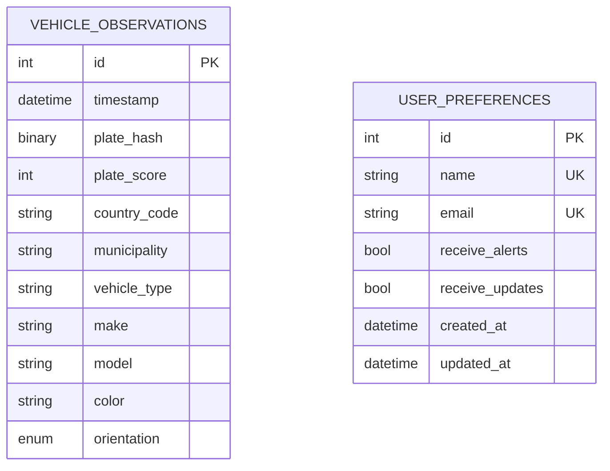
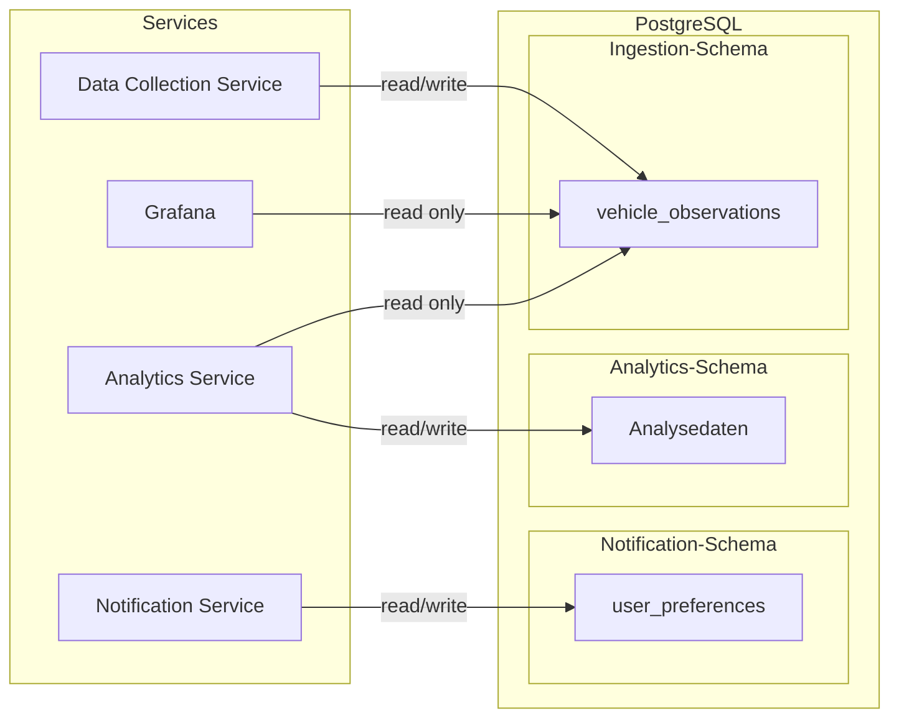

# Systementwurf und Architektur

## Gesamtarchitektur

Das System wurde als hybride Microservice-Architektur konzipiert, in der jeder funktionale Bereich als eigenständiger, containerisierter Service realisiert wird.
Hybrid meint in diesem Kontext primär, dass die einzelnen Services nicht ganzheitlich isoliert und entkoppelt sind, da nicht jeder dieser über eine eigene Datenhaltung verfügt.
Stattdessen nutzen alle Komponenten einen gemeinsamen PostgreSQL Service, welcher auf Schema-Ebene isoliert ist.
Auf dieses Konzept wird im Kapitel (!! CROSS REFERENCE) näher eingegangen.
Die Gesamtarchitektur wurde so entworfen, dass diese die in der Aufgabenstellung definierten Anforderungen abbildet.
Im Zuge der Entwicklung wurden nicht alle der im folgenden Kapitel erwähnten Komponenten implementiert, die bereits konzipierten Services werden dennoch in diesem Kapitel aus Gründen der Vollständigkeit erwähnt.

(ARCHITEKTUR-DIAGRAMM)

Wie in der Abbildung erkenntlich basiert diese Diplomarbeit aus Komponenten, welche sich in drei primäre Kategorien einteilen lassen: Backend-, Frontend- und  Infrastruktur-Services.
Darüber hinaus bestehen Anbindungen an externe Services (wie etwa die Plate Recognizer SDK). 
Sofern diese Implementiert wurden, werden sie im Kapitel Implementierung (!! Reference) beim jeweiligen Dienst im Detail erläutert.
Die Architektur folgt bewusst keinem API-Gateway Ansatz, wie es oft bei Microservice-Ansätzen typisch ist, da die Services primär intern kommunizieren und nur wenige Endpunkte nach außenhin offen zugänglich sind. 

#### Backend-Services

Das funktionale Backend des Systems bilden vier Python-Services basierend auf dem FastAPI-Framework.
Der Data Collection Service nimmt als Herzstück des Systems Webhook-Events der Synology Surveillance Station entgegen, sobald eine Fahrzeugbewegung im definierten Erkennungsbereich erkannt wurde. 
Dieser beantragt daraufhin einen Kamera-Snapshot, leitet diesen an die Plate Recognizer SDK weiter und speichert die verarbeiteten, anonymisierten Ergebnisse in der Datenbank.

Der Notification Service hat Möglichkeiten, um Benutzer-Einstellungen bezüglich E-Mail-Benachrichtigungen zu verwalten und den Versand dieser via SMTP zu steuern. 
Dieser Service kann etwa benutzt werden, um Tagesstatistiken oder Ähnliches mit Hilfe des Analytics Service bereitzustellen.

Der eben erwähnte Analytics Service (Auswertungsservice) wurde konzipiert, um analytische Endpunkte bereitzustellen, über welche Auswertungen und Vorhersagen aus gesammelten Erkennungsdaten abgerufen werden können.

Der Auth Service soll laut Konzeption Benutzer der Web-Oberfläche gegen das unternehmensinterne Active Directory authentifizieren, um eine nahtlose Integration in die bestehende Unternehmensinfrastruktur zu ermöglichen.

#### Frontend

Als Benutzeroberfläche sollte primär der Web Service, eine mit Next.js realisierte Web-Applikation dienen. 
Diese wurde als zentrale Oberfläche für Konfiguration und Verwaltung von Benachrichtigungen konzipiert und kommuniziert ausschließlich über REST-APIs mit den Backend-Services.
Als Übergangslösung und zweite Visualisierungsplatform dient Grafana, in Form eines Dashboards für diverse Statistiken.

#### Infrastruktur-Services

Die Infrastruktur-Ebene umfasst mehrere Stützkomponenten, die den Betrieb des Gesamtsystems ermöglichen.
PostgreSQL fungiert als zentrale relationale Datenbank für die persistente Datenhaltung aller Services.
Der Plate Recognizer SDK-Container stellt das lokal betriebene ALPR-Modell als REST-API bereit, sodass die Bildverarbeitung vollständig im lokalen Netzwerk stattfindet wie zuvor im Kapitel (!! CROSS REFERENCE) bereits ausführlich erklärt wurde.
Ein DB-Prestart-Container übernimmt die automatische Initialisierung der Datenbank beim Systemstart.
Ergänzend sorgt ein Backup-Container für regelmäßige, automatisierte Datenbanksicherungen.
Die Details zu diesen Infrastruktur-Komponenten werden im Kapitel Infrastruktur, Deployment und Betrieb (!! CROSS REFERENCE) näher erläutert.

### Kommunikationswege

Die Kommunikation zwischen den Services erfolgt ausschließlich über RESTful HTTP-APIs.
Der primäre Kommunikationsweg im System, also welcher für die Datenerfassung erfolgt, lässt sich wie folgt zusammenfassen:

1. Externer Trigger durch Erkennung eines Fahrzeugs -> Data Collection Service
Die Synology Surveillance Station ruft bei Erkennung einer Fahrzeugbewegung einen REST-Webhook des Data Collection Service auf..

2. Data Collection Service -> Synology API
Nach Empfang des Webhooks authentifiziert sich der Service bei der Synology-API, um einen aktuellen Kamera-Snapshot abzurufen.

3. Data Collection Service -> Plate Recognizer SDK
Der abgerufene Snapshot wird als Bilddatei per HTTP an den lokal betriebenen Plate Recognizer Container gesendet, der die Kennzeichenerkennung durchführt und das Ergebnis als JSON zurückgibt.

4. Data Collection Service -> PostgreSQL
Die verarbeiteten und anonymisierten Erkennungsergebnisse werden direkt in die Datenbank geschrieben.

Weitere konzipierte, teils implementierte Verbindungen:

5. Web Service -> Backend-Services
Die Web-Oberfläche kommuniziert über REST-Calls mit dem Auth Service (Benutzeranmeldung), dem Analytics Service für Analysen und dem Notification Service (Benachrichtigungsverwaltung).

6. Notification Service -> Analytics Service
Für den Versand von periodischen Zusammenfassungen ruft der Notification Service Daten vom Analytics Service ab.

7. Grafana -> PostgreSQL
Grafana greift über einen Read-only Datenbankbenutzer lesend auf das Data-Collection-Schema der Datenbank zu, um das Dashboard mit aktuellen Daten zu versorgen.

## Datenbankdesign

### Architekturansatz

Anstatt für jeden Microservice eine eigene PostgreSQL-Instanz zu betreiben, wurde eine Single-Database-Strategie auf Basis einer PostgreSQL-Instanz mit Schema-basierter Isolation gewählt.
Innerhalb der gemeinsam genutzten PostgreSQL-Datenbank existieren also drei, logisch getrennte Schemas:

1. Das Data-Collection-Schema (Ingestion) enthält die Kerndaten der Fahrzeugerkennungen.
2. Das Analytics-Schema (Analytics) ist für aggregierte oder vorberechnete Analysedaten konzipiert.
3. Das Notification-Schema (Notification) speichert Nutzerpräferenzen für den Benachrichtigungsdienst.

Dieser Ansatz, eine einzelne Datenbankinstanz durch Schemas logisch zu unterteilen, anstatt mehrere Instanzen zu betreiben, bietet im Kontext dieser Diplomarbeit mehrere Vorteile.
Zunächst reduziert er den operativen Aufwand, da nur eine Datenbankinstanz verwaltet, gesichert und überwacht werden muss, wie es etwa bei einer klassischen Microservice-Architektur der Fall wäre.
Dennoch bleibt die logische Trennung der Daten gewährleistet, da jeder Service nur auf sein zugewiesenes Schema zugreifen kann.
Des Weiteren vereinfacht er Cross-Schema-Lesezugriffe, etwa kann der Analytics Service oder Grafana Abfragen direkt auf die Ingestion-Daten zugreifen, ohne dass dafür eine Datenreplikation oder zusätzliche API-Aufrufe zwischen Services nötig sind.
Die Zugriffskontrolle wird dabei über dedizierte PostgreSQL-Benutzer mit minimalen Berechtigungen erzwungen, was im Abschnitt zum Sicherheitskonzept näher beleuchtet wird.

### Entitäten und ER-Modell

Das Datenbankschema des Systems umfasst zwei zentrale Entitäten, welche sich in getrennten Schemas befinden.

Die Tabelle vehicle_observations im Data-Collection-Schema ist die zentrale Entität des gesamten Systems.
Jeder Datensatz repräsentiert eine einzelne erfasste Fahrzeugerkennung und bildet die Grundlage für sämtliche Analysen und Visualisierungen.
Die Tabelle speichert neben dem Erkennungszeitpunkt und einem anonymisierten Hash des Kennzeichens auch den Konfidenzwert der Erkennung, das Herkunftsland, gegebenenfalls den Bezirk (für österreichische und slowenische Kennzeichen), Fahrzeugkategorie, Marke, Modell, Farbe sowie die Fahrtrichtung.
Letztere wird durch die Orientierung des Fahrzeugs (Vorder- oder Rückseite sichtbar) ermittelt und ermöglicht damit die Unterscheidung zwischen Ein- und Ausfahrten.

Die Tabelle user_preferences im Notification-Schema verwaltet die Benachrichtigungseinstellungen der Systembenutzer.
Sie speichert pro Benutzer den Namen und E-Mail Adresse sowie zwei Flags, welche festlegen, ob der Benutzer Echtzeit-Alerts oder periodische Zusammenfassungen per E-Mail erhalten möchte.

Die folgende Darstellung zeigt die Attribute der beiden Entitäten als ER-Diagramm:

### Argumentation zur Denormalisierung

Das Datenbankschema der vehicle_observations Tabelle ist bewusst nicht vollständig normalisiert.
Statt etwa country_code, vehicle_type, make, model und color in eigene Lookup-Tabellen mit Foreign-Key-Relationen auszulagern, werden diese direkt als Strings in der Observationstabelle gespeichert.

Diese Entscheidung beruht auf mehreren Gründen:

1. Datenherkunft aus externer API

Die Daten werden direkt aus der JSON-Antwort der Plate-Recognizer-API übernommen. 
Die API gibt eine flache Struktur zurück, in welcher das Erkennungsresultat alle Attribute bereits als einfache Zeichenketten oder Werte enthält.
Das Erstellen und die Wartung eines normalisierten Schemas mit Lookup-Tabellen für dynamische, von einer externen API stammende Werte, würde unnötige Komplexität hinzufügen und einen laufenden Wartungsaufwand bedeuten, da neue Werte (z.B. neue Fahrzeugmodelle) oder etwa Bennenungsanpassungen kontinuierlich eingepflegt werden müssten.

2. Lesedominanz

Die Daten werden primär lesend konsumiert, sowohl von Grafana für Dashboard-Visualisierungen als auch vom konzipierten Analytics-Service.
Bei leselastigen Workloads sind Verknüpfungen über mehrere Tabellen teurer als direkte Abfragen auf einer einzelnen, denormalisierten Tabelle.

3. Einfachheit der Abfragen

Die Grafana-Dashboards verwenden direkte SQL-Abfragen. Eine einfache, flache Tabellenstruktur macht diese Abfragen nicht nur lesbarer, sondern eliminiert auch die Fehleranfälligkeit, die durch komplexe JOIN-Befehle entstehen könnte.

4. Unveränderlichkeit der Daten

Fahrzeugerkennungen sind unveränderliche Ereignisse, im Gegensatz zu beispielsweise einem Produktkatalog, wo sich der Name eines Herstellers ändern kann, sind gespeicherte Erkennung statisch.
Die Hauptvorteile einer Normalisierung, etwa die konsistente Aktualisierung gemeinsamer Daten, sind daher nicht wirklich relevant.

5. Speicherplatz als unkritische Ressource

Die durch die Denormalisierung entstehende Datenredundanz, etwa wiederholt gespeicherte Herstellernamen, führt zu einem geringfügig höheren Speicherbedarf.
Dieser ist im vorliegenden Anwendungsfall jedoch vernachlässigbar, da das System auf einer NAS-Plattform mit erweiterbarem Speicher betrieben wird und die Datensatzgröße pro Erkennung minimal ist. 
Zum Stand der Dokumentation dieser Arbeit beträgt ein volles Backup der gesamten Datenbank (Über 60.000 Erkennungen) ca. 3.4 MB. 
Um diesen Punkt zu verdeutlichen wurde die Zeit, welche benötigt werden würde um einen Speicher in Größe des NAS-Systems mit Erkennungsdaten zu befüllen wurde durch die folgende Formel ermittelt.

Formel zur Berechnung der Speicherauffüllungdauer anhand der Größe eines Full-Backups:

$$T = \frac{S_{\max} D_t}{G_t}$$

wobei $T$ Tagen der Dauer bis zum vollständigen Befüllen eines Speicherplatzes $S_{\max}$ in Bytes entspricht, $G_t$ die Größe eines Full-Backups in Bytes und $D_t$ die vergangenen Tage seit Beginn der Kennzeichenerfassungen zum Zeitpunkt $t$ darstellen.

Als verfügbarer Speicherplatz $S_{\max}$ wurde 1TB ($10^{12}$ Bytes) angenommen, da dies dem Halben derzeit im NAS-System verbauten Speicher entspricht.
$G_t$ betrug (Stand 12. Februar 2026) wie bereits oben erwähnt rund 3,4MB ($3,4 \cdot 10^{6}$ Bytes) und zu diesem Stand sind 188 Tage ($D_t$) seit Beginn der Aufzeichnungen vergangen.

Es gilt dementsprechend:

$$T = \frac{10^{12} \cdot 188}{3{,}4 \cdot 10^6} \approx 5.53 \cdot 10^{7} \text{ Tage} / 365,25 \approx 151387 \text{ Jahre}$$

Das 1TB-NAS würde daraus folgend bei gleichbleibendem Wachstum also erst in rund 151 Tausend Jahren voll sein. 
Die Speicherkapazität ist damit für den praktischen Betrieb als unbegrenzt zu betrachten, selbst wenn der verfügbare Speicher als erheblich kleiner angenommen wird.

FOOTNOTE:
(Es ist anzumerken, dass die Größe eines Full-Backups zwar in einem linearen Zusammenhang mit der tatsächlichen Datenbankgröße steht, diese aber zum Beispiel durch komprimierung nicht vollständig widerspiegelt. 
(https://stackoverflow.com/questions/35480650/is-database-back-up-size-is-same-as-database-size, https://www.sqlskills.com/blogs/erin/trending-database-growth-from-backups/)
Auch nehmen die Erkennungs-Enträge nicht den gesamten Platz des Backups ein, da andere Daten wie etwa die anderer Services ebenfalls in diesem enthalten sind.
Das oben genannte Ergebnis ist aus diesen Gründen nur als Annäherung zu betrachten, wobei die Kernaussage ohne Zweifel bestehen bleibt.)

Die Herleitung dieser Formel ist dem Anhang zu entnehmen.

---

Herleitung der Formel zur Berechnung der Speicherauffüllungdauer anhand der Größe eines Full-Backups:

Die durchschnittliche Größe eines Datensatzes ($s$) ergibt sich aus:

$$s = \frac{G_t}{E_t}$$

wobei $G_t$ die Größe eines Backups und $E_t$ die Gesamtanzahl der Erkennungen zu diesem Zeitpunkt $t$ bezeichnen.
Die tägliche Erkennungsrate $r$ berechnet sich folgendermaßen:

$$r = \frac{E_t}{D_t}$$

wobei $D_t$ die Anzahl der bisherigen Aufzeichnungstage darstellt. 
Daraus lässt sich die Anzahl der Tage $T$ bestimmen, bis eine gegebene Speicherkapazität $S_{\max}$ erreicht ist:

$$T = \frac{S_{\max}}{s r}$$

Ausgehend von den oben aufgelisteten Formeln ergibt sich durch Einsetzen von \( s \) und \( r \) in \( T \):

$$T = \frac{S_{\max}}{\left(\frac{G_t}{E_t}\right)\left(\frac{E_t}{D_t}\right)}$$

Nach Kürzen von \( E_t \) folgt:

$$T = \frac{S_{\max}}{\frac{G_t}{D_t}}$$

wobei $\frac{G_t}{D_t}$ die durchschnittliche Speicherzunahme pro Tag beschreibt.
Damit ergibt sich die vereinfachte Formel:

$$T = \frac{S_{\max} D_t}{G_t}$$

---

## Sicherheitskonzept

Die Sicherheitsarchitektur des Systems ist in mehrere Schichten gegliedert, die jeweils unterschiedliche Aspekte des Schutzes adressieren.

### Authentifizierung und Endpunkt-Sicherheit

Die Absicherung der API-Endpunkte erfolgt je nach Service und Anforderung durch unterschiedliche Mechanismen:

#### Data Collection Service (HTTP Basic Authentication)

Der Webhook-Endpunkt `/api/vehicle_detected`, über den die Synology Surveillance Station Fahrzeugerkennungen meldet, ist durch HTTP Basic Authentication geschützt. 
Die Zugangsdaten werden dabei gegen die Synology-Credentials des Systems validiert.
HTTP Basic Authentication ist dabei die einzige von der Surveillance Station unterstützte Authentifizierungsmethode für Webhook-Aufrufe, weshalb hier keine Alternative in Frage kam.
Da der Endpunkt ausschließlich für die maschinenbasierte Kommunikation innerhalb des lokalen Netzwerks vorgesehen ist und nicht von außen erreichbar ist, ist dieses Sicherheitsniveau für diesen Anwendungsfall ausreichend.

#### Notification Service (API-Key Authentication)

Der Notification Service erwartet einen statischen API-Key im Authorization-Header jeder Anfrage.
Die Entscheidung gegen eine komplexere Authentifizierung, etwa mittels JWT (JSON Web Tokens) oder Session-basierter Tokens fiel aus mehreren Gründen:
Erstens findet die Kommunikation mit dem Notification Service ausschließlich intern zwischen Services statt, nicht direkt durch Endbenutzer,
zweitens würde eine JWT-basierte Lösung eine Schlüsselverwaltung (Signing Keys, Token-Rotation, Expiration-Handling) erfordern, die für einen reinen Service-zu-Service-Call unnötige Komplexität hinzufügt.
Die Notwendigkeit eines statischen API-Key, der über Umgebungsvariablen konfiguriert wird, kommt daher, dass der Port dieses Services zu Testzwecken freigeschaltet wurde. 
Für diesen Zweck bietet ein Token ein angemessenes Sicherheitsniveau bei geringer Komplexität.

#### Auth Service / Web Service (Active Directory Integration)

Für die Authentifizierung von Benutzern der Web-Oberfläche wurde die Integration mit dem bestehenden Active Directory (AD) der Firma Zotter konzipiert.
Dieser sollte mittels LDAP (Lightweight Directory Access Protocol)-Anbindung Nutzerdaten aus dem firmeninternen Microsoft-AD Server beziehen und diese für den Login-Prozess nutzen.
Dies bietet den Vorteil, dass keine separate Benutzerverwaltung implementiert und gewartet werden muss und die bestehende Unternehmensinfrastruktur zur Zugangskontrolle genutzt werden kann.

### Datenbankzugriffskontrolle

Ein zentrales Element der Sicherheitsarchitektur ist die konsequente Anwendung des Principle of Least Privilege, kurz PoLP auf Datenbankebene.
Jeder Service operiert mit einem eigenen, dedizierten PostgreSQL-Benutzer, dessen Rechte auf das absolut notwendige Minimum beschränkt sind.

Durch diese Segmentierung wird sichergestellt, dass im Falle einer Infiltration eines einzelnen Services der Zugriff auf Daten anderer Bereiche verhindert wird.
Der Notification Service kann beispielsweise keine Fahrzeugerkennungsdaten auslesen, und ein Angreifer mit Zugriff auf den Analytics Service könnte keine Daten verändern, da er nur Leserechte auf das Ingestion-Schema besitzt.

Die folgende Darstellung visualisiert die Berechtigungsstruktur:

Wie die Darstellung zeigt, hat der Data-Collection-User Vollzugriff auf das Ingestion-Schema, der Analytics-User nur Lesezugriff darauf (aber Vollzugriff auf das eigene Analytics-Schema), und der Notification-User ist vollständig auf das Notification-Schema beschränkt.
Grafana greift über den analytics_user ebenfalls ausschließlich lesend auf die Ingestion-Daten zu.

### Datenschutz und Umgang mit Kennzeichen-Daten

Der Umgang mit Kennzeichen-Daten ist aus DSGVO-Perspektive besonders sensibel, da Kennzeichen als personenbezogene Daten klassifiziert werden.
Das System implementiert deswegen eine mehrstufige Anonymisierungsstrategie:

1. Irreversibles Hashing
Unmittelbar nach der Erkennung wird das Kennzeichen mittels SHA-256 gehasht.
Dieser Hash ist ein kryptographisch sicherer, irreversibler Einwegprozess. 
Heißt, aus dem gespeicherten Hash kann das Originalkennzeichen nicht mehr rekonstruiert werden, zwei erkannte Kennzeichen können dennoch auf ihre Gleichheit analysiert werden.
In der Datenbank wird ausschließlich der 32-Byte-Hash (plate_hash) gespeichert, nicht das Klartext-Kennzeichen.

2. Keine Speicherung von Bilddaten
Die Kamera-Snapshots, aus welchen die Kennzeichen extraktiert werden, werden nicht persistent gespeichert.
Die Bilddaten existieren lediglich temporär im Arbeitsspeicher, während sie zur Erkennung verarbeitet werden.

3. Verarbeitung im lokalen Netzwerk
Wie im Kapitel zur ALPR-Technologie erläutert, läuft der Plate Recognizer als lokaler Container.
Sämtliche Bilddaten und Erkennungsergebnisse verlassen zu keinem Zeitpunkt das lokale Netzwerk der Firma Zotter.

### Datenlebenszyklus (Data Lifecycle)

Der Lebenszyklus der Fahrzeugerkennung beschreibt den logischen Weg der Daten von der Erfassung bis zur langfristigen Sicherung.
Das Konzept ist so gestaltet, dass personenbezogene Daten so früh wie möglich eliminiert werden und nur anonymisierte, für die Analyse relevante Informationen persistent gespeichert werden.

Der Lebenszyklus gliedert sich in sechs Phasen:

1. Erfassung
Eine Fahrzeugbewegung im Erkennungsbereich löst ein Event aus, welches das System über einen Webhook benachrichtigt.

2. Extraktion
Das System ruft einen aktuellen Kamera-Snapshot ab und sendet diesen an die lokale ALPR-Komponente zur Kennzeichenerkennung. Die Bilddaten werden dabei nicht persistent gespeichert.

3. Anreicherung
Die Erkennungsergebnisse werden angereichert: Ländercodes werden normalisiert und, wo möglich, wird die regionale Herkunft auf Bezirksebene ermittelt.

4. Anonymisierung
Das Klartext-Kennzeichen wird mittels eines kryptografischen Einweg-Hash-Verfahrens irreversibel anonymisiert. Ab diesem Punkt existiert das originale Kennzeichen in keinem Teil des Systems mehr.

5. Speicherung
Der anonymisierte und angereicherte Datensatz wird in der Datenbank gespeichert.

6. Sicherung
Die Datenbank wird regelmäßig automatisiert gesichert. Details zur Backup-Strategie werden im Kapitel Infrastruktur, Deployment und Betrieb behandelt.

Durch diesen Lebenszyklus ist sichergestellt, dass personenbezogene Daten, wie oben erwähnt, zu keinem Zeitpunkt persistent gespeichert werden und die gespeicherten, anonymisierten Daten eine Rückverfolgung auf individuelle Fahrzeuge nicht ermöglichen.
Die konkrete technische Umsetzung der einzelnen Phasen wird im Kapitel Implementierung genauer beschrieben.
